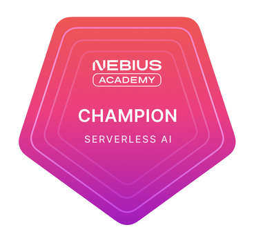
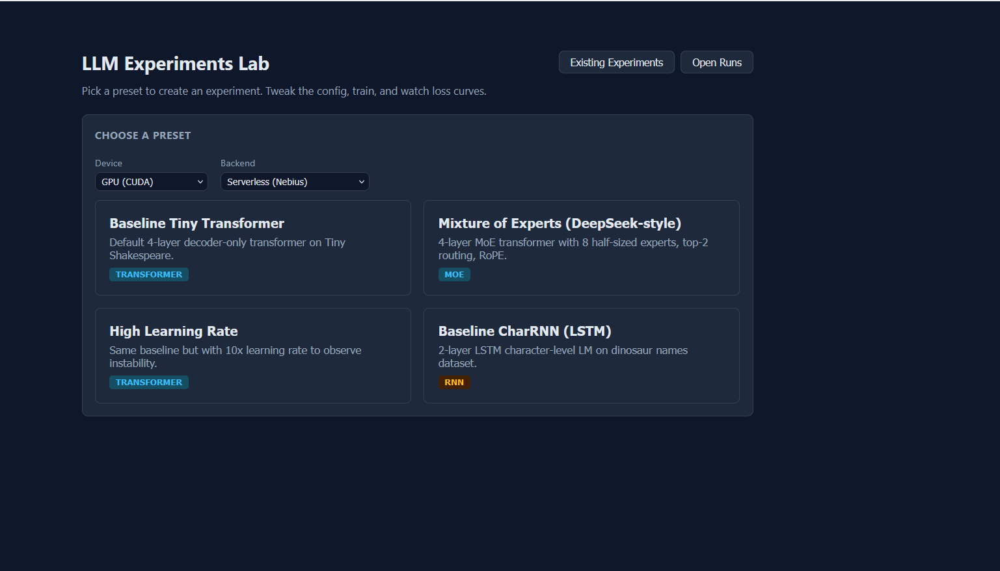

# LLM Experiments Lab

[](LICENSE)

This is a browser-based lab for hands-on LLM architecture experiments. Pick a preset model config. Select from three tokenizers: character, BPE small, and BPE medium. Tweak hyperparameters, train on CPU or GPU — locally or on a Nebius serverless endpoint — and watch loss curves update live. Built for the Nebius Serverless AI Builders Challenge where it won an award:

- [Credly badge](https://www.credly.com/badges/9534c97b-96a9-45bf-a115-8d4a0aa7166d)
- [LinkedIn announcement](https://www.linkedin.com/posts/stan-fedotov_this-summer-nebius-and-nebius-academy-ran-share-7495130381227118592-cREJ/?utm_source=share&utm_medium=member_desktop&rcm=ACoAAAHTsHwBOdu-WztF04WZ_KdS_Re3vTiZ4ms)



## Why This Exists

No code, no Python environment, no cloud account wrangling — pick a preset, adjust hyperparameters in a sidebar, and watch a real language model train. LLM Experiments Lab exposes the few controls that teach and hides the technical details that distract, inspired by the Nebius Academy AI Performance Engineering course.

- **Watch training as it happens** — live loss/validation charts update as the model trains, no separate logging setup, no TensorBoard.
- **Pause mid-training and ask what it knows** — prompt the partially-trained model, see its actual generated response, resume, and try the same prompt again later. Watch it go from near-random characters to recognizable structure, live.
- **Look inside one forward pass** — the Inspector panel exposes tensor shapes, attention maps, Q/K/V vectors, embeddings, and the LM head's actual top-k token candidates: the machinery a loss curve alone never shows.
- **A chatbot that knows *this* experiment** — grounded in your data, code, config, metrics, tensors, logs, and diagnostics, not a generic LLM explainer.
- **Server metrics and logs, live** — CPU/GPU utilization, memory, and step-by-step training events, right alongside the model code.
- **Cost-conscious and environmentally friendly by design** — runs locally or on Nebius serverless endpoints, with idle auto-stop so a GPU never sits running (and burning power) for nobody. Concurrent runs on the same device type share one already-warm endpoint instead of each spinning up its own machine, so idle compute isn't wasted and no one pays for — or powers — a second GPU that wasn't actually needed.

## Screenshots



*Landing page — pick a preset to start from.*


*Main dashboard — config panel, live loss chart, and training controls.*

https://github.com/user-attachments/assets/829fcb1b-731e-4eca-8485-bd18bda68e97

## What It Does

You select from preset experiments (tiny transformers, MoE variant, RNNs), optionally adjust config (layers, heads, learning rate, etc.), hit "Start", and watch training happen with live loss charts. You can pause training mid-run, prompt the model with text to see current output quality, then resume or stop. When done, export your experiment as a standalone `.py` script or Jupyter notebook.

**Available presets:**

| Preset | Architecture | Dataset | Purpose |
|--------|-------------|---------|---------|
| Baseline Tiny Transformer | 4-layer decoder-only | Tiny Shakespeare | Default starting point |
| Mixture of Experts (DeepSeek-style) | MoE transformer | Tiny Shakespeare | Sparse expert routing vs dense baseline |
| High Learning Rate | Same as baseline + 10x LR | Tiny Shakespeare | Observe training instability |
| Baseline CharRNN (LSTM) | 2-layer LSTM | Dinosaur names | RNN vs Transformer comparison |

## Architecture

- **Backend:** FastAPI + SQLite (async via aiosqlite). Runs training in-process with PyTorch. Streams metrics to frontend via polling (WebSocket endpoint also available).
- **Frontend:** React + TypeScript + Vite. Recharts for loss visualization. Polls backend every 2s during training.
- **Database:** SQLite file (`lab.db`, auto-created on first run). Stores experiments, training runs, and metrics.

| Layer | What it is | Where it runs |
|-------|-----------|----------------|
| Frontend | React + TypeScript + Vite UI — config panel, live charts, Inspector, chatbot | Your browser (`npm run dev`, port 5173) |
| Backend | FastAPI + SQLite — the API/orchestrator: experiments, runs, chatbot, diagnostics | Your machine (`uv run uvicorn`, port 8000) |
| Trainer | The actual PyTorch training loop, one OS subprocess per run | Either **local** (in-process on your machine, same codebase as the backend) or **remote** (proxied to a Nebius serverless CPU/GPU endpoint — see [Hardware Configuration](#hardware-configuration)) |

## Hardware Configuration

Training runs locally (in-process, on your own machine) by default. Selecting
"Serverless (Nebius)" as the backend instead offloads the run to a Nebius AI
Endpoint on this hardware (see `config/settings.py` for the source of truth):

| Device | Platform | Preset | Notes |
|--------|----------|--------|-------|
| CPU | `cpu-d3` | `16vcpu-64gb` | Handles multiple concurrent CPU runs — see [Current Status](#current-status) |
| GPU | `gpu-l40s-a` (NVIDIA L40S) | `1gpu-8vcpu-32gb` | 1x L40S, 8 vCPU, 32GB RAM |

Both device types use a **single shared endpoint** (not one per run) — see
[Current Status](#current-status) below and `docs/DESIGN_DECISIONS.md` §63 for
why, and the concurrency caps.

## Docker Images

Two images, both built from this repo — the backend/frontend run directly via
`uv`/`npm` (see [Setup & Run](#setup--run)), not as a Docker image; only the
trainer, which is what actually gets deployed to a Nebius endpoint, is
containerized:

| Image | Dockerfile | Purpose |
|-------|-----------|---------|
| CPU trainer | `Dockerfile.trainer-cpu` | Deployed to the Nebius CPU endpoint — CPU-only PyTorch, no CUDA |
| GPU trainer | `Dockerfile.trainer-gpu` | Deployed to the Nebius GPU endpoint — CUDA PyTorch |

Build/push scripts: `scripts/build_push_trainer_cpu.sh`, `scripts/build_push_trainer_gpu.sh`.
Both images are the same codebase as the backend (`backend/`, `config/`) —
split into two Dockerfiles only so the CPU endpoint doesn't have to pull CUDA
PyTorch it can't use.

## Prerequisites

- Python 3.11+
- Node.js 18+
- [uv](https://github.com/astral-sh/uv) (Python package manager)

## Setup & Run

### 1. Backend

From the `llm_experiments_lab/` directory:

```bash
# Install Python dependencies
uv sync

# Start the API server (port 8000)
uv run uvicorn backend.main:app --reload
```

Verify: `curl http://localhost:8000/api/health` should return `{"status":"ok"}`.

API docs at `http://localhost:8000/docs` (Swagger UI).

### 2. Frontend

In a second terminal, from `llm_experiments_lab/frontend/`:

```bash
# Install JS dependencies (first time only)
npm install

# Start dev server (port 5173)
npm run dev
```

Open `http://localhost:5173` in browser.

### 3. Nebius Serverless

By default training runs locally, no Nebius account needed. To use serverless
GPU/CPU endpoints instead:

1. Copy `.env.example` to `.env` and fill in your Nebius Token Factory API
   key (for the chatbot) and Nebius serverless credentials. Field names/
   defaults are documented inline in `config/settings.py`.
2. Install and authenticate the `nebius` CLI: `scripts/install_nebius_cli.sh`
   (see that script for the service-account auth flow).
3. Push the trainer images (or use your own registry — see
   [Docker Images](#docker-images) above): `scripts/build_push_all_trainers.sh`.
4. In the app, pick "Serverless (Nebius)" as the backend before clicking
   Start. The app creates/reuses a Nebius AI Endpoint automatically — first
   use takes a few minutes to cold-start (see
   [Approximate Runtime & Cost](#approximate-runtime--cost) below).

## How to Use

1. **Pick a preset** from the landing page — this creates an experiment in the database.
2. **Tweak config** in the left sidebar (tokenizer, model dimensions, training hyperparams).
3. **Click Start** — training begins on the selected device (CPU or GPU). Loss chart updates live.
4. **Pause** mid-training to prompt the model and see its current text generation quality.
5. **Resume or Stop** when ready.
6. **Export** your experiment as a `.py` script or `.ipynb` notebook via the export bar.
7. **View code** — the actual model and data source files are shown in the Code View panel.

## Expected Outputs

- **Live training/validation loss charts** — update as training progresses, whichever backend/device you chose.
- **Generated text samples** — pause a run and prompt the model at its current checkpoint to see output quality partway through training.
- **Step-by-step diagnostics** (Inspector panel) — per-node tensor shapes, top-k logits, attention weights, and input/output vectors for every layer, steppable one forward pass at a time.
- **A reproducible artifact** — export the run as a standalone `.py` script or `.ipynb` notebook (Export bar) that reruns the exact same experiment outside the app.
- **Metrics/config JSON** — every run's config, metrics, and status are queryable via the API (`/api/training/{id}/metrics`, `/status`) and persisted in `lab.db`.

## Approximate Runtime & Cost

The dominant cost is Nebius **GPU** time, roughly **$5/hour** for the L40S
preset above (CPU-only runs cost nothing beyond the CPU endpoint's own, much
lower rate). Rough breakdown for a single GPU session:

| Phase | Time |
|-------|------|
| Endpoint cold start (first use only — reused after) | ~5 min |
| A single training run (the presets above are small/fast) | a few minutes |
| Pausing to prompt/experiment with the model | up to ~30 min if you linger |
| **Total for a full session (start, train, review, play with prompts)** | **~1 hour, ~$5** |

Once an endpoint is warm, starting additional runs against it is near-instant
(no repeat cold start) — see [Hardware Configuration](#hardware-configuration)
and `docs/DESIGN_DECISIONS.md` §63 for the shared-endpoint model.

## API Endpoints

| Method | Path | What |
|--------|------|------|
| GET | `/api/health` | Health check |
| GET | `/api/experiments` | List all experiments |
| POST | `/api/experiments/from-preset/{key}` | Create from preset |
| GET | `/api/experiments/presets` | List available presets |
| POST | `/api/training/start` | Start training run |
| POST | `/api/training/{id}/pause` | Pause run |
| POST | `/api/training/{id}/resume` | Resume run |
| POST | `/api/training/{id}/prompt` | Prompt paused model |
| GET | `/api/code/{id}/export.py` | Download .py script |
| GET | `/api/code/{id}/export.ipynb` | Download notebook |

## Project Structure

```
llm_experiments_lab/
├── backend/
│   ├── main.py              # FastAPI app entry point
│   ├── db.py                # SQLite operations
│   ├── api/                 # Route handlers (experiments, training, codegen)
│   ├── training/
│   │   ├── runner.py        # Training loop orchestration
│   │   └── templates/       # Model code (transformer/, rnn/)
│   └── export.py            # Script/notebook generation
├── frontend/
│   └── src/
│       ├── App.tsx           # Main layout + state management
│       └── components/       # UI panels (config, chart, controls, code view)
├── config/
│   └── presets.py            # Hardcoded experiment presets
├── lab.db                    # SQLite database (auto-created)
└── pyproject.toml            # Python dependencies
```

## Current Status

Working: preset selection, experiment creation, training with live metrics, pause/resume/stop, model prompting during pause, code view, export to .py and .ipynb.

Training runs on CPU or GPU, either in-process locally or offloaded to a remote
Nebius serverless endpoint (device/backend selectable per run; see
`default_device`, `max_concurrent_local_*_runs`, `max_concurrent_serverless_*_runs`,
and the `gpu_yield_*` settings in `config/settings.py`). No auth/multi-user
support yet.

**Nebius serverless capacity is fixed, not elastic.** There is one shared
endpoint per device type (`worker-cpu`, `worker-gpu`) — every serverless run
for that device gets proxied to the same container, up to
`max_concurrent_serverless_{cpu,gpu}_runs` concurrent runs each (each run is
its own OS subprocess inside that container, so this is real multi-core
parallelism, not GIL-limited). There's no hardware-tier selector in the
frontend (e.g. choosing L40S vs H100, or a bigger/smaller CPU preset) and no
auto-scaling to a second endpoint once the cap is hit — a request beyond the
cap just gets a 429. This was a deliberate POC trade-off (avoids paying for
and cold-starting a second endpoint when the existing one has spare vCPU/VRAM
capacity), not an oversight. See `docs/DESIGN_DECISIONS.md` §63 for the
tiered-preset-selector idea if this needs to become elastic later.

## Further Reading

[What If You Could Pause a Language Model While It Is Learning?](https://nodozi.substack.com/p/what-if-you-could-pause-a-language) — the motivation and design thinking behind this project, in more depth.

## License


[MIT](LICENSE)
