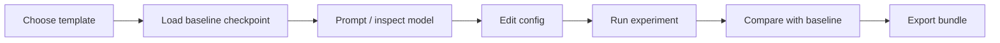
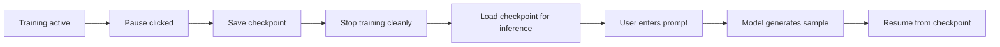
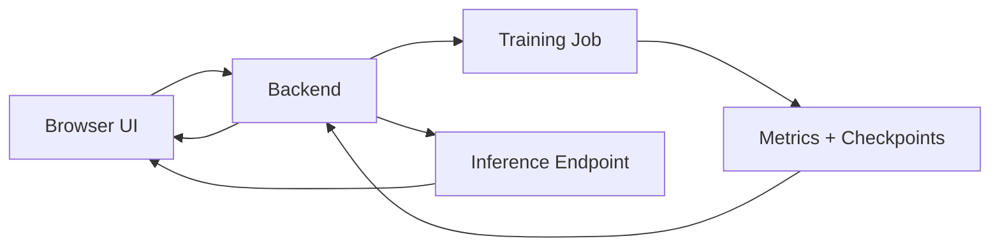

# LLM Experiments Lab — Compact Project Outline

## 1. Summary

The **LLM Experiments Lab** is a browser-based learning environment where users turn large language model theory into controlled experiments. Instead of open-ended notebooks, users start from guided templates, change a small number of important settings, train a small model, watch the loss curve, pause training, prompt the partly trained model, compare results, and export the experiment.

> **Concept:** TensorFlow Playground for modern language model concepts — but with real training runs, checkpoints, generated code, and exportable notebooks.

## 2. Core User Journey

Each template should include a baseline configuration and, where practical, one or more pre-trained checkpoints. This lets the user inspect and prompt a working model before launching their own experiment.



The product should still encourage hypothesis-driven learning, but prediction should be part of the lab manual or assistant prompts, not a mandatory step in the main flow. For example, before running a RoPE vs sinusoidal experiment, the assistant may ask: “What do you expect to change and why?” The user can skip this.

## 3. Main Features

| Feature                    | Purpose                                                                                                                                                       |
| -------------------------- | ------------------------------------------------------------------------------------------------------------------------------------------------------------- |
| Template library           | Curated experiments such as tiny transformer, RoPE vs sinusoidal, MoE vs dense block, learning-rate sensitivity.                                              |
| Baseline checkpoints       | Each template can include saved checkpoints so users can immediately prompt, inspect, and compare against a known baseline before training their own variant. |
| No-code config UI          | Users edit architecture and training settings through sliders, toggles, and dropdowns.                                                                        |
| Live architecture view     | Model diagram updates as the config changes.                                                                                                                  |
| Live training curve        | Training and validation loss stream while the run is active.                                                                                                  |
| Pause-and-prompt           | Users stop at checkpoints and test the partly trained model with a text prompt.                                                                               |
| Run comparison             | Compare baseline vs changed runs on the same axes.                                                                                                            |
| Grounded chatbot           | Explains results using config, metrics, last change, and lab manual context.                                                                                  |
| Exportable code            | Export scripts, notebook, config, metrics, and README.                                                                                                        |
| Public/private experiments | Users can keep runs private or publish forkable versions.                                                                                                     |

## 4. User Interface

| Area       | Contents                                                                                         |
| ---------- | ------------------------------------------------------------------------------------------------ |
| Experiment | Template, question, hypothesis, fixed variables, changed variable.                               |
| Config     | Layers, embedding width, number of heads, positional encoding, learning rate, batch size, steps. |
| Results    | Loss curves, generated samples, checkpoints, comparisons.                                        |
| Assistant  | Explanations, troubleshooting, suggested next experiment.                                        |

The config UI should use a compact **stackable layer list**:

```text id="5nrjtx"
Embedding → Transformer Block × N → LayerNorm → Output Head
```

Users expand each block to edit settings. Model-level settings, such as positional encoding, sit above the stack. Training settings, such as learning rate and batch size, sit in a separate training panel.

## 5. Pause-and-Prompt

Pause-and-prompt works in two ways: users can prompt a supplied baseline checkpoint immediately, and they can also prompt their own partially trained checkpoints during a run.

“Pause” is checkpoint-based rather than a literal frozen process.



This makes training progress tangible. A learner can prompt the model at step 500, 1,500, and 5,000 and see outputs move from noisy text toward more coherent language.

## 6. Exported Experiment Bundle

Each experiment should export as a reproducible folder:

```text id="sbq653"
experiment/
  config.json        # architecture, data, training settings, seed
  model.py           # neural network classes, forward(), generate()
  data.py            # dataset loading, tokenisation, batching
  train.py           # training, validation, metrics, checkpoints, pause handling
  generate.py        # inference from a saved checkpoint
  notebook.ipynb     # learner-friendly explanation + runnable cells
  metrics.jsonl      # step-by-step metrics
  README.md          # experiment question, fixed variables, result
  requirements.txt   # dependencies
```

The **config file is the single source of truth**. The UI, model code, training script, notebook, run metadata, and chatbot context should all be derived from the same config. This avoids the common problem where the UI says one thing but the Python code does another.

## 7. Editing Model and Code

For the first version, users should edit experiments through the no-code UI, not by directly editing arbitrary Python. This keeps experiments safe, reproducible, and comparable.

| Editing route                  | Version   | Notes                                                     |
| ------------------------------ | --------- | --------------------------------------------------------- |
| UI edits config                | MVP       | Safest and clearest route.                                |
| Chatbot suggests config change | MVP       | User applies change manually through UI.                  |
| “Apply suggestion” button      | Later     | Chatbot proposes a validated config patch; user confirms. |
| Direct Python editing          | Later/TBD | Powerful but risks breaking UI-code synchronisation.      |

The exported notebook and scripts are for learning, sharing, and external reuse. The production run should use validated config-driven scripts.

## 8. Chatbot Role

The chatbot should begin as a **grounded teaching assistant**, not a free-form coding agent. It should see:

* current config;
* loss curve and recent metrics;
* last user change;
* lab manual entry;
* comparable previous runs.

Example responses:

* “Your loss spiked after increasing the learning rate.”
* “The MoE run improved loss, but expert usage looks imbalanced.”
* “This is not a fair comparison because two variables changed.”

The chatbot can later gain controlled tools, but it should not initially read arbitrary files, modify code, or launch jobs without user confirmation.

## 9. Minimal Technical Shape



The technical layer should stay simple: browser sends validated configs, backend launches managed training runs, metrics and checkpoints are saved as artifacts, and inference loads checkpoints for pause-and-prompt.

## 10. Design Principle

> **The config drives everything: UI, model code, training script, notebook export, metrics, and chatbot context.**

This keeps the Lab educational, reproducible, and easier to extend.
